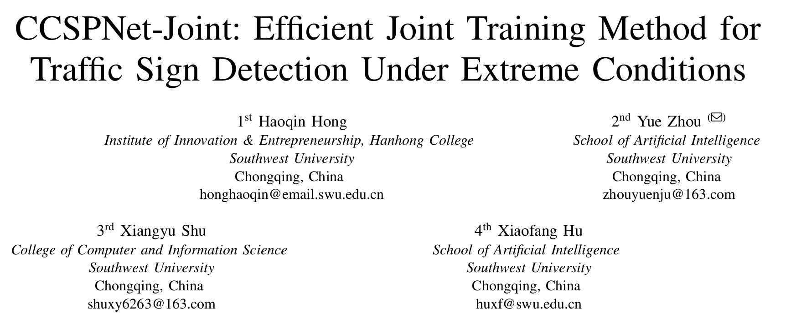
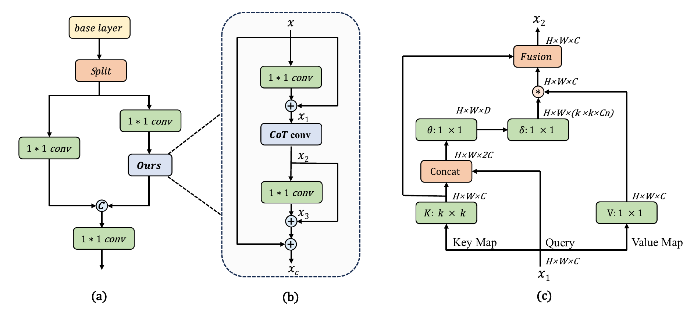

##### UPDATE 2024.3.15

###### Our paper was accepted by the 2024 International Joint Conference on Neural Networks (IJCNN 2024 Oral).

##### UPDATE 2024.8.25 
###### To make using our methodology easier, we uploaded our full dataset *[CCTSDB-AUG](https://www.kaggle.com/datasets/haoqinhong/cctsdb-aug-ijcnn-2024)* on the KAGGLE platform (Please cite our paper and dataset).

###### You can also compare our metrics in *[Paper with Code](https://paperswithcode.com/paper/ccspnet-joint-efficient-joint-training-method)*.

##### Project Guidence 
The image denoising module of our model utilizes the 4kDehazing model(cite: https://github.com/zzr-idam/4KDehazing.git), 
while the object detection module incorporates the improved model CCSPNet, 
which is based on the YOLOv5 baseline, as proposed in our article.
This model is a joint training model, and each training session will generate two pth files: 'best.pt' for the object detection model 
and 'best_4k.pt' for the image denoising model.

The proposed method and comparisons in this paper were conducted under a unified data augmentation approach. To replicate the experiments, you will need to download the dataset and pre-trained weights and place them in a specific directory. 
Then, in the terminal, run the command：python train_ccspnet_joint.py --rect

It is worth noting that the joint training model defines a joint loss function calculation formula as 
loss = alpha * loss1 + beta * loss2, 
where alpha and beta are hyperparameters. Through extensive experimentation, it has been found that setting alpha = beta = 0.5 yields good results.
 
##### The repository includes:

###### 1.CCSPNet model:
     CCSPNet-Joint/models/yolov5l-efficientvit-b2-cot.yaml

###### 2.pretrained_pth:
     Renew 2025.7.12
     Update the Download Link in Kaggle: https://www.kaggle.com/datasets/haoqinhong/pre-tained-weight-of-ccspnet-joint
     
     Renew 2025.3.31
     Download link： https://pan.baidu.com/s/1wnC7apkmf2W0OgqxLhDpgw 
     Verification code：e3tu
     Content:
     ccspnet-joint.pt
     our_deblur40.pth
     resnet50-0676ba61.pth
     
     checkpoints\efficientViT\b2-r288.pt: 
     Download link: https://pan.baidu.com/s/1gmXAfND0roMpjCeLO4htlg    Verification code：tl7e 

###### 3.Dataset:
    CCTSDB: https://github.com/csust7zhangjm/CCTSDB.git
    Augment method for CCTSDB-AUG:  StimulateExtreme.py
    We also provide our whole dataset in KAGGLE.

##### Please cite our work:
    @INPROCEEDINGS{10651346,
      author={Hong, Haoqin and Zhou, Yue and Shu, Xiangyu and Hu, Xiaofang},
      booktitle={2024 International Joint Conference on Neural Networks (IJCNN)}, 
      title={CCSPNet-Joint: Efficient Joint Training Method for Traffic Sign Detection Under Extreme Conditions}, 
      year={2024},
      pages={1-8},
      doi={10.1109/IJCNN60899.2024.10651346}}

